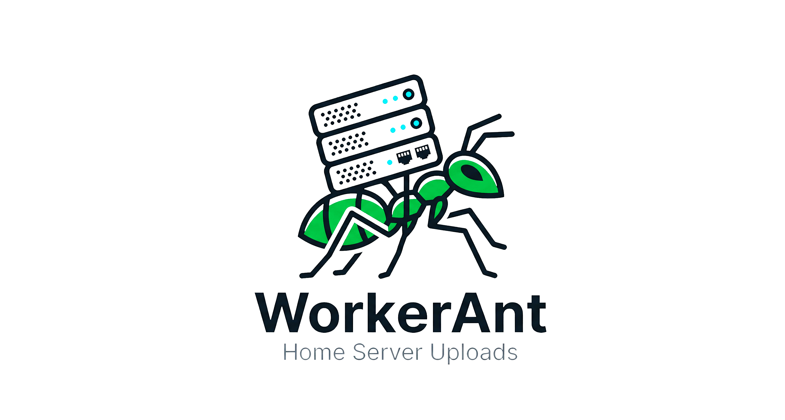

# WorkerAnt

<p align="center">
  
</p>

O **WorkerAnt** é um servidor de upload de arquivos construído com Flask e PostgreSQL.

## 🛠️ Tecnologias Utilizadas
- **Linguagem:** Python 3.12+
- **Framework:** Flask
- **Banco de Dados:** PostgreSQL
- **ORM:** SQLAlchemy
- **Containerização:** Docker & Docker Compose
- **Gerenciamento de Dependências:** uv (ou pip)

---

## 🚀 Como Executar o Projeto

Você pode rodar este projeto de duas formas: usando o script de automação (`manage.bat`) para Docker ou manualmente.

### 🐳 1. Via Docker (Recomendado)

O projeto já conta com um script para facilitar a execução no Windows.

1.  Certifique-se de que o **Docker Desktop** está rodando.
2.  Abra o terminal na raiz do projeto.
3.  Execute o comando para subir os serviços:
    ```bash
    manage.bat run
    ```
    Isso iniciará o banco de dados PostgreSQL e o servidor Flask.

#### Outros Comandos do `manage.bat`:
- `manage.bat run_dev`: Inicia o banco no Docker e o servidor Flask localmente.
- `manage.bat clean`: Para e remove os containers.
- `manage.bat rebuild`: Reconstrói as imagens e reinicia os containers.
- `manage.bat dmk`: Cria a pasta `uploads` se ela não existir.

---

### 🐍 2. Execução Manual

Para rodar o projeto manualmente, você precisará de uma instância do PostgreSQL rodando e as dependências instaladas.

#### Passo 1: Iniciar o Banco de Dados
O modo mais fácil é rodar apenas o container do banco:
```bash
cd docker
docker compose up -d db
cd ..
```

#### Passo 2: Instalar Dependências
Recomendamos o uso de um ambiente virtual:
```bash
python -m venv venv
source venv/bin/activate  # No Windows: venv\Scripts\activate
```

Instale as dependências:
```bash
pip install flask bcrypt psycopg2 sqlalchemy
```
*(Se você usa o `uv`, basta rodar `uv sync`)*

#### Passo 3: Configurar Variáveis de Ambiente
Certifique-se de que a conexão com o banco de dados em `app/infra/configs/connection.py` (ou onde estiver configurado) aponta para os dados do Docker:
- **Host:** `localhost`
- **User:** `root`
- **Password:** `root`
- **DB:** `data_db`

#### Passo 4: Rodar o Servidor
```bash
python main.py
```
O servidor estará disponível em: [http://localhost:3333](http://localhost:3333)

---

## 📂 Estrutura do Projeto
- `app/`: Contém a lógica da aplicação (UI e Infraestrutura).
- `docker/`: Configurações do Docker e Docker Compose.
- `uploads/`: Pasta onde os arquivos enviados são armazenados.
- `main.py`: Ponto de entrada da aplicação Flask.
- `manage.bat`: Script de automação para Windows.
